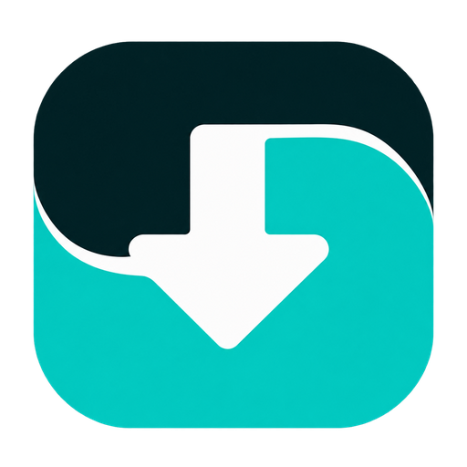
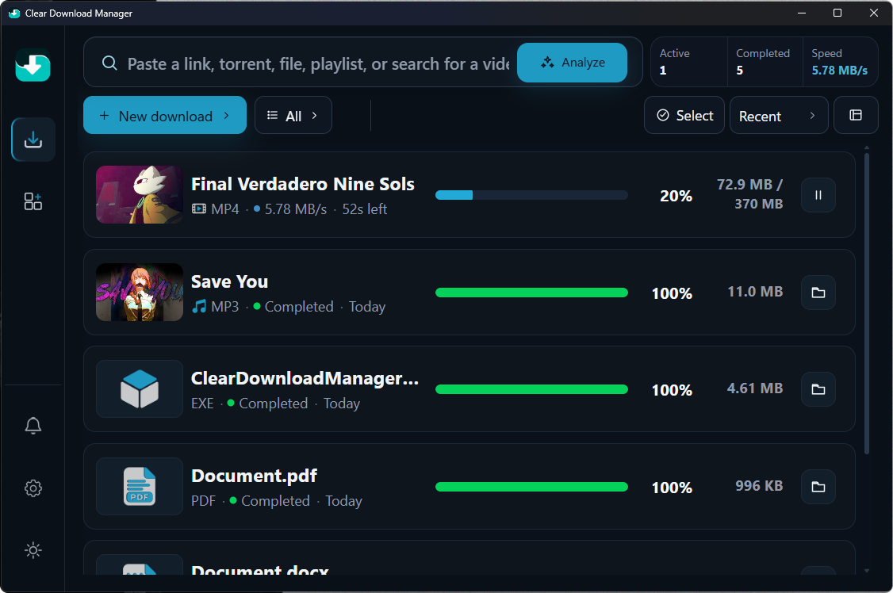
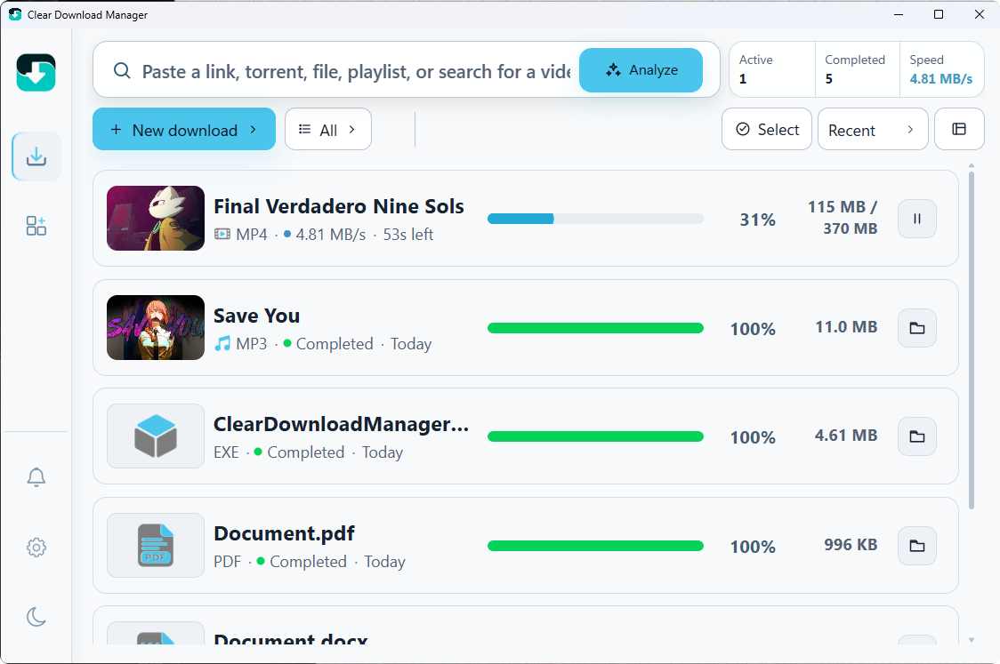
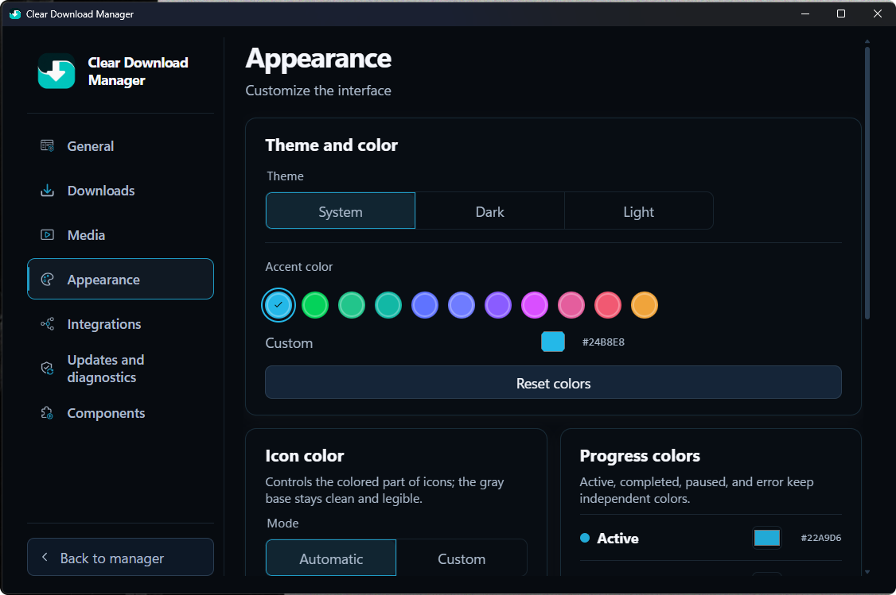
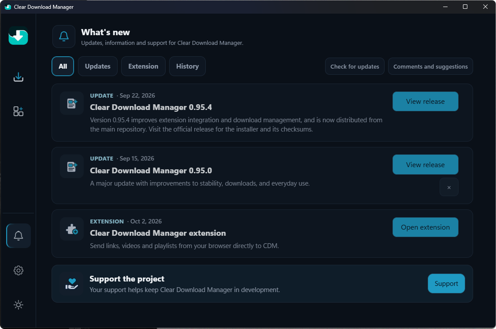

<p align="center">
  
</p>

<h1 align="center">Clear Download Manager</h1>
<p align="center">Download and multimedia manager for Windows</p>
<p align="center">Clear Download Manager (CDM) is a local Windows application for organizing HTTP/HTTPS downloads, video, audio, playlists, torrents and direct links. It is built with Tauri and Rust and includes optional Chromium browser integration.</p>

<p align="center">
  &nbsp;
  &nbsp;
  &nbsp;
  &nbsp;
  
</p>
<p align="center"></p>

## Downloads

Choose the option that works best for you.

<p align="center">
  <a href="https://github.com/CacaPlay/clear-download-manager/releases/download/v1.0.0/ClearDownloadManagerSetup.exe">
    <picture>
      <source media="(prefers-color-scheme: dark)" srcset="docs/assets/download-buttons/windows-dark.png">
      
    </picture>
  </a>&nbsp;
  <a href="https://apps.microsoft.com/detail/9NSTJ7JXM843?hl=es-mx&amp;gl=US&amp;ocid=pdpshare">
    <picture>
      <source media="(prefers-color-scheme: dark)" srcset="docs/assets/download-buttons/microsoft-store-dark.png">
      
    </picture>
  </a>&nbsp;
  <a href="https://chromewebstore.google.com/detail/clear-download-manager/aonppfnabjnicjjeoofkfjofolfibggp">
    <picture>
      <source media="(prefers-color-scheme: dark)" srcset="docs/assets/download-buttons/chrome-web-store-dark.png">
      
    </picture>
  </a>
</p>

The installer button downloads the published v1.0.0 setup directly. The [latest Windows release](https://github.com/CacaPlay/clear-download-manager/releases/latest) has the current installer, checksum manifest, signature and updater metadata.

### What do I need?
- **Install the app:** use the Windows installer or Microsoft Store.
- **Browser integration:** install the extension from Chrome Web Store.
- **Already have CDM:** install only the extension if you want to send content from your browser.

## See CDM before you install

<table>
  <tr>
    <td align="center"><strong>Downloads · Dark</strong><br></td>
    <td align="center"><strong>Downloads · Light</strong><br></td>
  </tr>
  <tr>
    <td align="center"><strong>Appearance settings</strong><br></td>
    <td align="center"><strong>What’s new</strong><br></td>
  </tr>
</table>

## What it does
- Core HTTP/HTTPS downloads work without optional runtimes. Media and torrent features use optional local components that CDM can install and manage separately.
- HTTP/HTTPS downloads with resume, persistent queue and real progress.
- Video, audio and playlist downloads through yt-dlp.
- Torrents and magnet links through aria2c.
- Media processing with FFmpeg and FFprobe.
- SQLite history, categories, priorities, concurrency and bandwidth limits.
- Local player with safe full-screen playback for any aspect ratio.
- Light/dark/system themes with synchronized accent colors.
- Optional Chromium integration through Native Messaging.

## Basic usage
1. Open CDM and paste a link, file, torrent or playlist.
2. Select **Analyze** or the appropriate action.
3. Review quality, folder and priority before starting.

The app keeps the queue and history locally on this device.

## Verify the installer
Download the installer and `SHA256SUMS.txt` from the [latest release](https://github.com/CacaPlay/clear-download-manager/releases/latest), then compare the checksum for the installer before running it. The release also includes the installer signature and updater metadata.

## Requirements
Published builds require a compatible Windows x64 installation. WebView2, Node.js and Rust/MSVC are required only for development.

## Privacy and support
CDM is designed to work locally. Do not commit installers, databases, logs, credentials, cookies or private keys. See the [extension privacy policy](docs/extension/PRIVACY.md), [`SECURITY.md`](SECURITY.md) and [`SUPPORT.md`](SUPPORT.md).

## Development

For a Windows development environment, install Node.js, Rust with the MSVC
toolchain, and the Microsoft C++ Build Tools. Tauri uses WebView2 on Windows;
see the [official Tauri 2 prerequisites](https://v2.tauri.app/start/prerequisites/)
for current setup instructions. No private account, signing key or production
credential is needed for the local checks below.

Start from a clean clone:

```powershell
git clone https://github.com/CacaPlay/clear-download-manager.git
Set-Location clear-download-manager
npm.cmd ci --no-audit --no-fund
npm.cmd run check:release
cargo fmt --manifest-path src-tauri/Cargo.toml --all -- --check
cargo check --locked --manifest-path src-tauri/Cargo.toml
cargo test --locked --manifest-path src-tauri/Cargo.toml --lib
npm.cmd run tauri -- dev
```

The final command compiles and starts the local desktop development app. The
`check:release` script runs the current focused source-contract checks; it does
not build or publish a release. Multimedia and torrent workflows may require
the separately licensed runtime tools described in
[`docs/THIRD-PARTY-RUNTIMES.md`](docs/THIRD-PARTY-RUNTIMES.md).

To compile a runnable local desktop executable from source without creating an
installer or signing a release, run:

```powershell
npm.cmd run build:local
```

This uses the Tauri CLI, which runs `npm run build:web` and embeds the generated
`dist/` frontend in the executable. The result is
`src-tauri/target/release/clear-download-manager.exe`. Use this command for a
standalone app build; `cargo build --release` alone only compiles the Rust
crate and can leave the app pointing at the development server on
`127.0.0.1:4173`. The local executable is not an installer or a release package.

Build scripts clear their output directories before writing. See the
[build and packaging guide](docs/BUILD-AND-PACKAGING.md) before creating local
packages. Publishing a release follows the separately gated
[`docs/RELEASE-GUIDE.md`](docs/RELEASE-GUIDE.md).
```text
app-ui/       interface, local player and download manager
src-tauri/    Tauri/Rust engine, SQLite and IPC
extension/    Chromium extension and native host
scripts/      build, validation and maintenance tools
docs/         technical contracts and development documentation
```

Read the [architecture overview](docs/ARCHITECTURE.md) before changing module boundaries.

## Contributing and licensing
Project-authored source code is licensed under [GNU GPL-3.0-or-later](LICENSE.md); the full license text is in [`COPYING`](COPYING). Third-party components retain their own licenses and notices. The GPL does not grant rights to project names, logos or other marks. See [NOTICE.md](NOTICE.md), [TRADEMARKS.md](TRADEMARKS.md), and the [third-party runtime inventory](docs/THIRD-PARTY-RUNTIMES.md).

Read [`CONTRIBUTING.md`](CONTRIBUTING.md), [`CODE_OF_CONDUCT.md`](CODE_OF_CONDUCT.md) and [`SECURITY.md`](SECURITY.md) before sending changes. Contributions must be yours to submit or submitted with permission, and third-party assets must include their source and license information.
