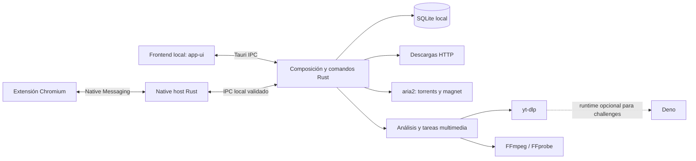

# Arquitectura de Clear Download Manager

Este documento describe la organización actual del checkout y los límites que
conviene conservar al cambiarlo. Es una guía de lectura; no define una API
pública ni garantiza que los componentes opcionales puedan omitirse hoy.

## Recorrido principal

Las líneas muestran responsabilidades, no todos los mensajes, procesos ni
estados. El ejecutable de escritorio se compone desde `src-tauri`; el frontend
se sirve desde `app-ui` durante desarrollo y se integra en `dist/` para el
build web. El host de extensión es otro binario Rust bajo
`extension/native-host/`.

## Mapa de módulos

| Área | Ubicación principal | Responsabilidad y límite actual |
| --- | --- | --- |
| Interfaz | `app-ui/` | Pantallas, estado de presentación, player local, internacionalización y llamadas IPC. No debe abrir bases SQLite ni ejecutar procesos del sistema directamente. |
| Aplicación Tauri | `src-tauri/src/commands/`, `dispatcher.rs`, `lib.rs` | Valida solicitudes IPC, conecta módulos y registra el arranque. `lib.rs` todavía contiene orquestación de comandos; no es una capa de dominio independiente. |
| Persistencia | `src-tauri/src/db/` | Esquema, consultas y migraciones SQLite. Las migraciones deben ser aditivas o preservar explícitamente los datos históricos. |
| Descargas HTTP | `src-tauri/src/downloads/` | Validación/inspección, cola, concurrencia, almacenamiento, recuperación, un único escritor y descarga secuencial con `reqwest`. Este flujo funciona separado del motor torrent. |
| Torrents | `src-tauri/src/torrents/`, `src-tauri/src/progress/aria2.rs` | Adaptación del motor externo aria2 y traducción de su progreso al modelo de la aplicación. No se debe mezclar con la autoridad de escritura HTTP. |
| Multimedia | `src-tauri/src/media/` | Análisis, selección de formato, proveedores, playlists, cola, recuperación y descarga multimedia. Los módulos `providers/` concentran conocimiento específico de fuentes. |
| Runtime y procesos | `src-tauri/src/app/{process,runtime,network}.rs`, `src-tauri/src/tools/` | Descubrimiento de herramientas, argumentos de proceso, políticas de red, integridad y confianza del catálogo. Las claves de prueba no representan confianza de producción. |
| Extensión | `extension/` y `extension/native-host/` | La extensión detecta y envía acciones permitidas; el host valida mensajes y los transporta a la app. La identidad pública versionada no es una clave privada. |
| Actualización | `src-tauri/src/update_manager.rs`, `src-tauri/src/store_update_manager.rs` y `src-tauri/resources/updater/` | La función `github-updater` y la variante `microsoft-store` son excluyentes. La publicación de GitHub sigue bloqueada por las protecciones remotas documentadas. |
| Empaquetado | `src-tauri/tauri*.conf.json`, `scripts/`, `.github/workflows/` | El build GitHub, MSIX y ZIP de extensión tienen contenidos y salidas distintas; véase `BUILD-RELEASE-AUDIT.md`. |

## Límites de confianza importantes

- La interfaz solicita operaciones mediante comandos Tauri registrados; las
  rutas y entradas externas se deben validar en Rust antes de tocar disco o
  iniciar un proceso.
- Las descargas HTTP tienen validación de destino y redirects, pero la revisión
  de seguridad mantiene pendiente el endurecimiento frente a cambios DNS entre
  comprobación y conexión. Los motores externos y el tráfico P2P tienen límites
  de red distintos; véase `SECURITY-REVIEW.md`.
- SQLite contiene historial y configuración local. Las pruebas de migración se
  ejecutan con bases en memoria; no se inspeccionan automáticamente perfiles ni
  bases de instalaciones reales.
- yt-dlp, Deno, aria2, FFmpeg y FFprobe son programas externos con términos
  propios. Su presencia en un paquete requiere inventario, avisos y los
  materiales de fuente correspondientes que se describen en
  `THIRD-PARTY-RUNTIMES.md`.
- El puente de extensión es una frontera IPC local y debe conservar límites de
  tamaño, acciones permitidas y validación de origen.

## Límites para la modularidad futura

La evolución puede profundizar límites internos sin introducir todavía un
sistema de plugins/providers:

1. Mantener persistencia y políticas de descargas HTTP utilizables sin
   inicializar multimedia, yt-dlp, FFmpeg, FFprobe o Deno. Esto es un objetivo
   de diseño, no una garantía de arranque ya probada en una instalación sin
   esas herramientas.
2. Conservar torrents detrás de una interfaz interna de engine/adapter que
   contenga los detalles de aria2 y sus eventos de progreso.
3. Mantener procesos multimedia y sus modelos de datos dentro de `media/`; no
   propagar nombres, argumentos ni formatos propios de yt-dlp/FFmpeg al
   almacenamiento de descargas HTTP.
4. Hacer que los módulos de dominio reciban capacidades explícitas (almacenamiento,
   procesos, red) desde la composición de la app. No mover comandos Tauri ni
   crear un registro dinámico de plugins como parte de una limpieza.
5. Preservar comandos IPC, datos SQLite, rutas de configuración y contratos
   visibles salvo que una migración o cambio funcional se solicite aparte.

## Construir y verificar

El proyecto está orientado actualmente a Windows x64. Los requisitos del
toolchain para Windows se mantienen en la guía oficial de
[prerrequisitos de Tauri 2](https://v2.tauri.app/start/prerequisites/); el
repositorio no incluye toolchains privados. Para un entorno limpio, los pasos
de npm, pruebas y ejecución de desarrollo están en `../README.md`. Los scripts
de empaquetado pueden limpiar sus directorios de salida predeterminados; lee
`BUILD-RELEASE-AUDIT.md` y usa un clon limpio para producir artefactos.

El estado de licencia del código y de los assets se explica en
`../LICENSE.md`, `../NOTICE.md`, `../TRADEMARKS.md` y
`OPEN-SOURCE-RIGHTS-REVIEW.md`. La documentación no constituye una autorización
de redistribución.
